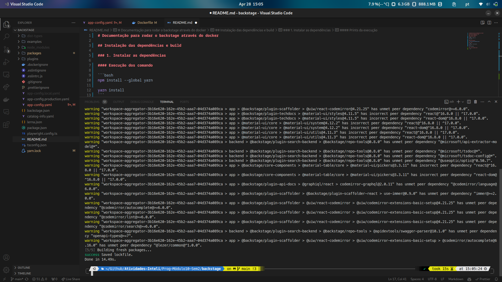
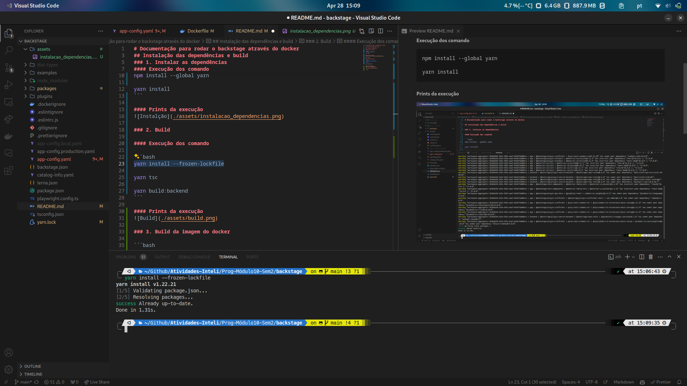
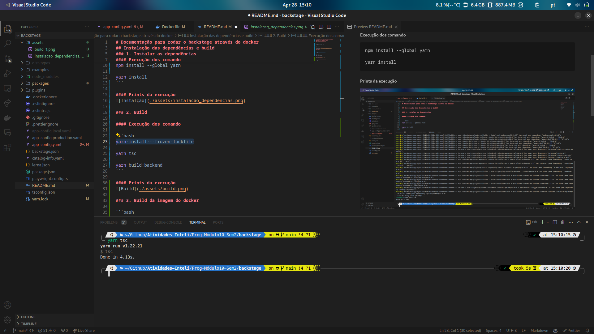
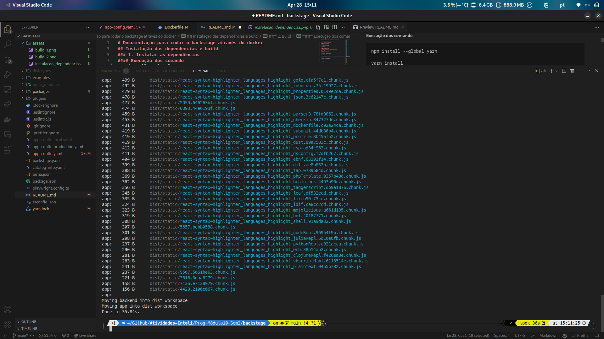
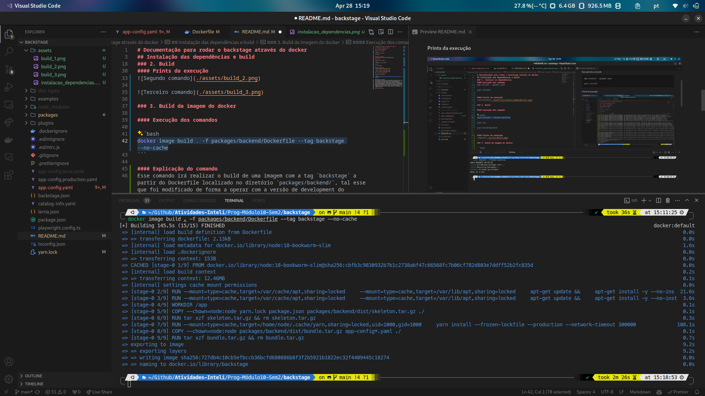
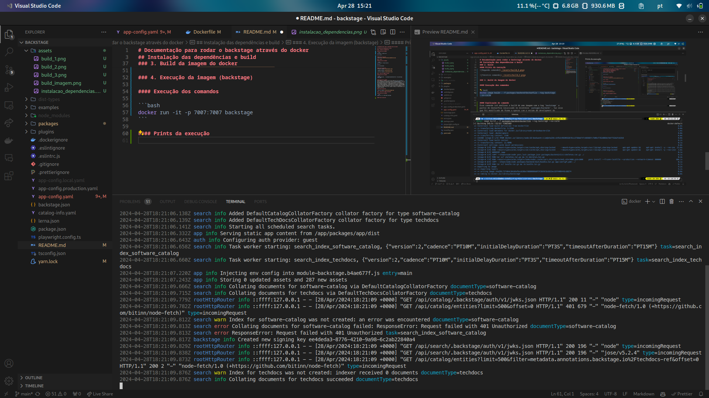
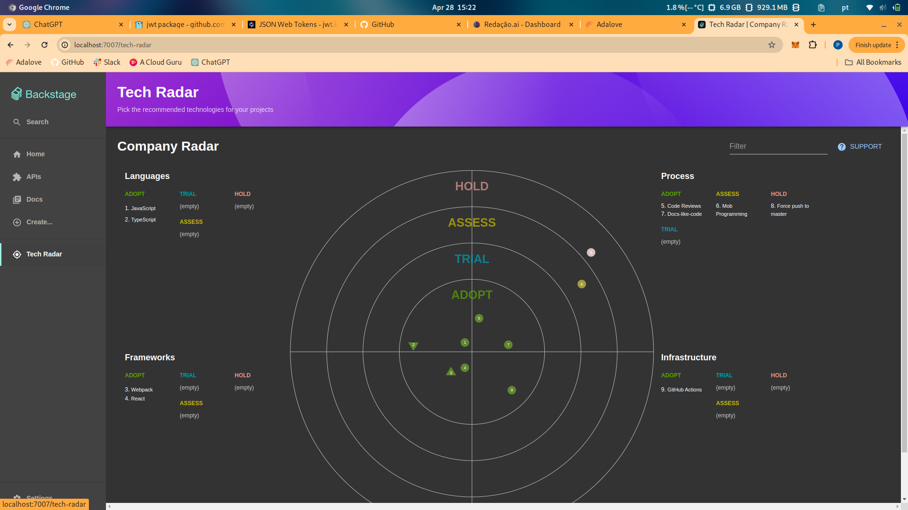
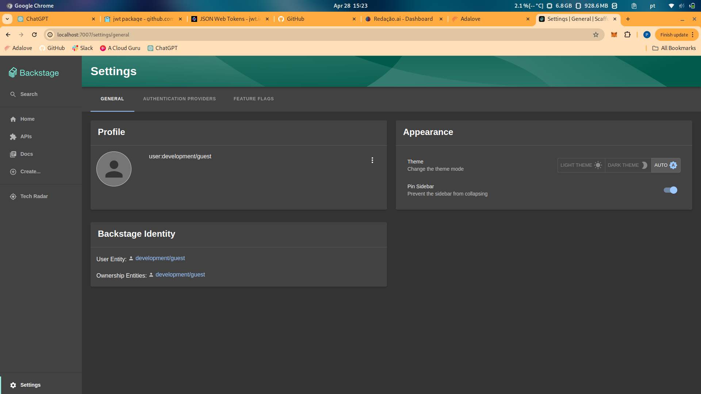

# Documentação para rodar o backstage através do docker

## Instalação das dependências e build

### 1. Instalar as dependências

#### Execução dos comando

```bash
npm install --global yarn

yarn install
```

#### Prints da execução


### 2. Build

#### Execução dos comandos

```bash
yarn install --frozen-lockfile

yarn tsc

yarn build:backend
```

#### Prints da execução






### 3. Build da imagem do docker

#### Execução dos comandos

```bash
docker image build . -f packages/backend/Dockerfile --tag backstage --no-cache
```

#### Explicação do comando
Esse comando irá realizar o build de uma imagem com a tag `backstage` a partir do Dockerfile localizado no diretório `packages/backend/`, tal esse que foi modificado de forma a operar com a versão de development do backstage que se utiliza de um banco de dados SQlite, isso porque ao rodar com a versão de produção há a necessidade de subir junto ao backstage um banco de dados PostgresSQL, tornando assim mais complexo, sem necessidade. Ademais foi adicionado uma tag --no-cache, com intuito de buildar a imagem inteira do 0 com base no Dockerfile, sem utilizar outras imagens que estiverem em cache (evitar erros, quando a máquina já rodou diversas vezes imagens similares).

#### Prints da execução



### 4. Execução da imagem (backstage)

#### Execução dos comandos

```bash
docker run -it -p 7007:7007 backstage
```

#### Prints da execução



### 5. Acessar o backstage

#### Acessar o backstage
Acesse o seu navegador e digite `http://localhost:7007` para acessar o backstage.

#### Prints da execução




