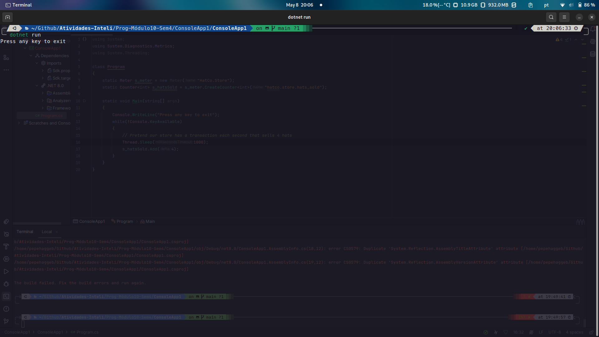
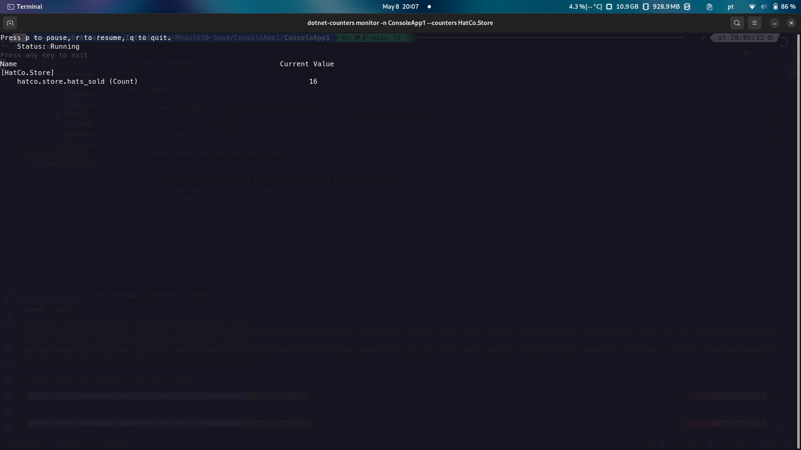
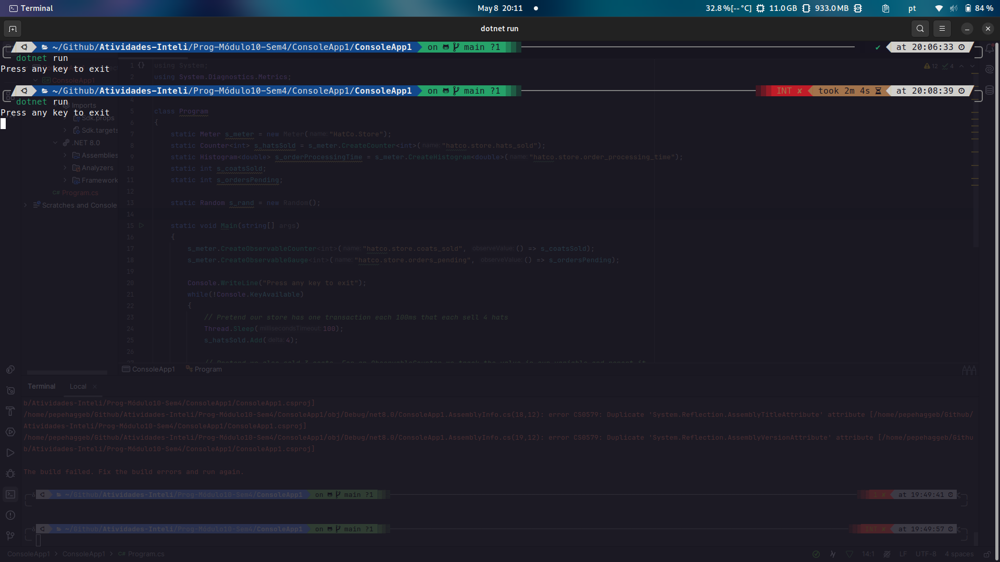
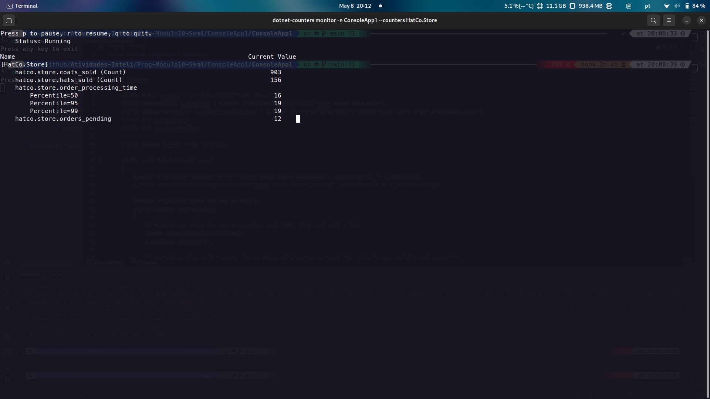
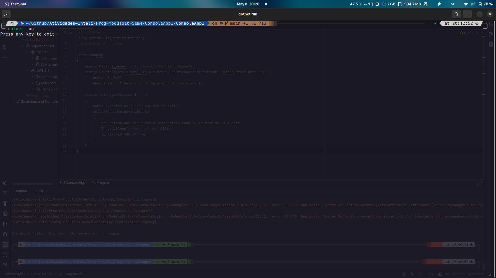
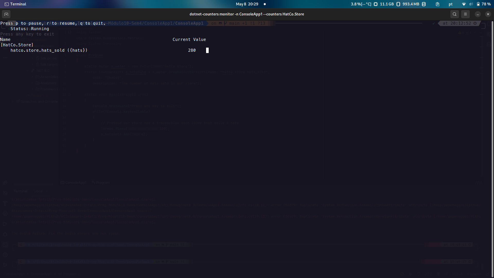
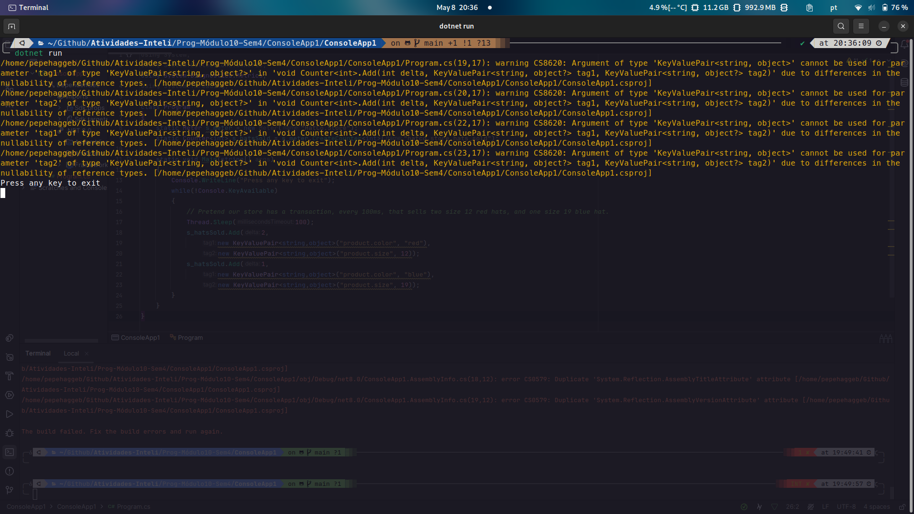
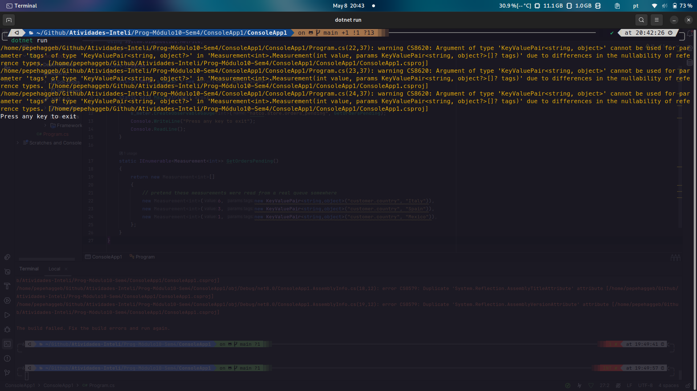
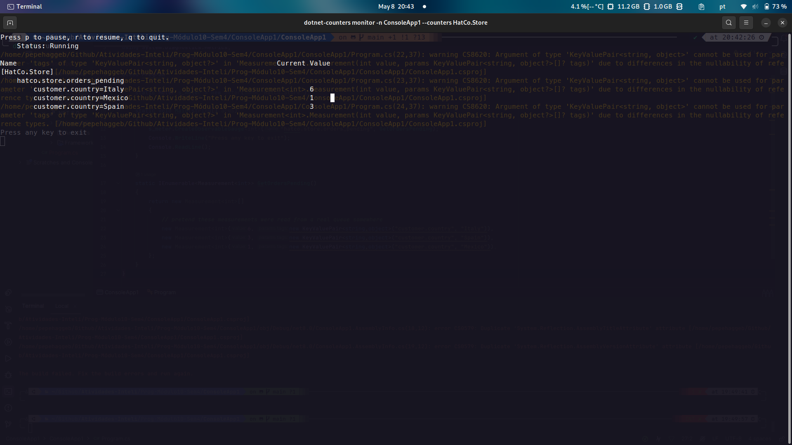
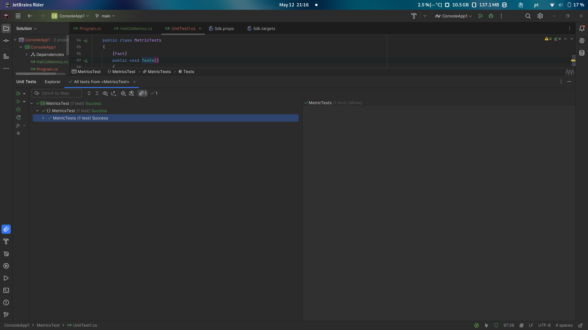

# Documentação do avanço na realização da atividade ponderada sobre métricas

## 1. Introdução
Esse documento tem como objetivo apresentar o avanço na realização da atividade ponderada sobre métricas, que consiste em explorar a API de métricas do .NET para monitorar e registrar eventos dentro de uma aplicação. A documentação é baseada no tutorial oficial da Microsoft sobre o tema, que fornece exemplos práticos de como utilizar a API de métricas para coletar e analisar dados de desempenho em tempo real. O tutorial aborda conceitos fundamentais, como contadores, histogramas, observáveis e métricas multidimensionais, e demonstra como essas ferramentas podem ser aplicadas em cenários do mundo real para monitorar e otimizar o desempenho de aplicações.

## 2. Desenvolvimentos

### 2.1. Desenvolvimento 1

#### 2.1.1. Descrição
Nesta etapa do tutorial, presente na documentação da Microsoft, o código C# desenvolvido demonstra um exemplo simples de como utilizar a API de métricas do .NET para monitorar e registrar eventos dentro de uma aplicação. Além de descrever cada parte do código, esta seção explicará como as métricas podem ser visualizadas utilizando a ferramenta dotnet-counters para monitorar a aplicação em tempo real.

#### 2.1.2. Código

```csharp
using System;
using System.Diagnostics.Metrics;
using System.Threading;

class Program
{
    static Meter s_meter = new Meter("HatCo.Store");
    static Counter<int> s_hatsSold = s_meter.CreateCounter<int>("hatco.store.hats_sold");

    static void Main(string[] args)
    {
        Console.WriteLine("Press any key to exit");
        while(!Console.KeyAvailable)
        {
            // Pretend our store has a transaction each second that sells 4 hats
            Thread.Sleep(1000);
            s_hatsSold.Add(4);
        }
    }
}
```

#### 2.1.3. Execução
O código está sendo executado através do comando dotnet run no diretório do projeto C# localizado em Atividades-Inteli/Prog-Módulo10-Sem4/ConsoleApp1/ConsoleApp1. Após a rodagem do código com o intuito de visualizar as métricas geradas por esse como definidas nele próprio rodamos o comando `dotnet-counters monitor -n ConsoleApp1 --counters HatCo.Store`. Todas as execução (tanto do código em si quanto do comando de monitoramento) foram feitas no terminal e as prints de execução se localizam na secção abaixo.

#### 2.1.4. Comportamento do dotnet-counters para esse desenvolvimento
Ao executar o comando dotnet-counters monitor -n ConsoleApp1 --counters HatCo.Store, configuramos o dotnet-counters para monitorar a aplicação ConsoleApp1.exe e coletar métricas especificamente do instrumento HatCo.Store. Detalhes do que você pode esperar visualizar incluem:

- Contador hatco.store.hats_sold: A cada segundo, você deve observar o valor deste contador aumentar em 4, refletindo as vendas simuladas de chapéus pelo código. Este comportamento ilustra a utilidade da instrumentação em aplicações para monitoramento de desempenho em tempo real.

#### 2.1.4. Resultados
As prints dos resultados obtidos após a execução do código e do comando de monitoramento ilustram o aumento contínuo no contador de chapéus vendidos, destacando a capacidade de acompanhar atividades específicas dentro da aplicação. Essas visualizações são essenciais para análises de desempenho e diagnósticos em tempo real.





### 2.1.6 Considerações adicionais
- **Impacto no Desempenho**: É importante notar que a instrumentação e o monitoramento de métricas podem ter um impacto no desempenho da aplicação. Recomenda-se avaliar este impacto durante o desenvolvimento para garantir que a sobrecarga seja aceitável em um ambiente de produção.

- **Segurança e Privacidade**: Ao implementar qualquer forma de monitoramento ou coleta de dados, considere as implicações de segurança e privacidade. Certifique-se de que todas as coletas de dados estejam em conformidade com as leis e regulamentos aplicáveis, especialmente ao lidar com informações sensíveis ou identificáveis.

### 2.2. Desenvolvimento 2

#### 2.2.1. Descrição
Esta etapa do tutorial, baseada na documentação da Microsoft, avança o uso da API de métricas do .NET com uma aplicação C# que não só conta itens vendidos, mas também adiciona um histograma para medir tempos de processamento e observáveis para monitorar variáveis que mudam ao longo do tempo. Esta seção explica como implementar e monitorar estas métricas avançadas usando `dotnet-counters`.

#### 2.2.2. Código

```csharp
using System;
using System.Diagnostics.Metrics;
using System.Threading;

class Program
{
    static Meter s_meter = new Meter("HatCo.Store");
    static Counter<int> s_hatsSold = s_meter.CreateCounter<int>("hatco.store.hats_sold");
    static Histogram<double> s_orderProcessingTime = s_meter.CreateHistogram<double>("hatco.store.order_processing_time");
    static int s_coatsSold;
    static int s_ordersPending;
    static Random s_rand = new Random();

    static void Main(string[] args)
    {
        s_meter.CreateObservableCounter<int>("hatco.store.coats_sold", () => s_coatsSold);
        s_meter.CreateObservableGauge<int>("hatco.store.orders_pending", () => s_ordersPending);

        Console.WriteLine("Press any key to exit");
        while(!Console.KeyAvailable)
        {
            Thread.Sleep(100);
            s_hatsSold.Add(4);
            s_coatsSold += 3;
            s_ordersPending = s_rand.Next(0, 20);
            s_orderProcessingTime.Record(s_rand.NextDouble() * 15 + 5);
        }
    }
}
```

#### 2.2.3. Execução
Execute o código através do comando dotnet run no diretório Atividades-Inteli/Prog-Módulo10-Sem4/ConsoleApp1/ConsoleApp1. Para monitorar as métricas, utilize o comando dotnet-counters monitor -n ConsoleApp1 --counters HatCo.Store no terminal.


#### 2.2.4. Comportamento do dotnet-counters para esse desenvolvimento
Ao monitorar com dotnet-counters, a aplicação produzirá:

- hatco.store.hats_sold: Conta cada venda de 4 chapéus a cada 100ms.
- hatco.store.coats_sold: Observa as vendas de casacos, acumulando 3 a cada iteração.
- hatco.store.orders_pending: Mostra um número aleatório de pedidos pendentes entre 0 e 20.
- hatco.store.order_processing_time: Registra um tempo de processamento simulado de pedidos entre 5 e 20 segundos.

#### 2.2.5. Resultados
Inclua screenshots ou descrições dos resultados visíveis no terminal após a execução do comando de monitoramento, ilustrando o comportamento em 
tempo real das métricas.




#### 2.2.6. Considerações adicionais
- **Impacto no Desempenho**: Avalie o overhead de desempenho introduzido pelo monitoramento intensivo de métricas.
- **Segurança de Dados**: Garanta a conformidade com padrões de segurança e privacidade ao coletar e monitorar dados sensíveis.

### 2.3. Desenvolvimento 3

#### 2.3.1. Descrição
Este segmento do tutorial, que também deriva da documentação oficial da Microsoft, explora a adição de metadados aos instrumentos de métrica no .NET para enriquecer a interpretação dos dados coletados. Descrições e unidades são especificadas para cada métrica, oferecendo um contexto adicional que pode ser crucial para engenheiros e desenvolvedores durante a análise de desempenho. Esses metadados não afetam os cálculos realizados pelas métricas, mas são exibidos pelas ferramentas de monitoramento para fornecer insights mais claros sobre o que cada métrica representa.

#### 2.3.2. Código

```csharp
using System;
using System.Diagnostics.Metrics;
using System.Threading;

class Program
{
    static Meter s_meter = new Meter("HatCo.Store");
    static Counter<int> s_hatsSold = s_meter.CreateCounter<int>(name: "hatco.store.hats_sold",
                                                                unit: "{hats}",
                                                                description: "The number of hats sold in our store");

    static void Main(string[] args)
    {
        Console.WriteLine("Press any key to exit");
        while(!Console.KeyAvailable)
        {
            // Pretend our store has a transaction each 100ms that sells 4 hats
            Thread.Sleep(100);
            s_hatsSold.Add(4);
        }
    }
}
```

#### 2.3.3. Execução
Após modificar o código em `Program.cs` com os metadados apropriados para os instrumentos de métrica, o programa deve ser executado utilizando o comando `dotnet run` no diretório do projeto. Para visualizar como essas descrições e unidades aparecem na prática e facilitam a compreensão das métricas, é recomendado usar o comando `dotnet-counters monitor -n ConsoleApp1 --counters HatCo.Store` no terminal.

#### 2.3.4. Comportamento do dotnet-counters para esse desenvolvimento
A inclusão de descrições e unidades nos instrumentos de métrica é uma prática recomendada para tornar os dados coletados mais acessíveis e compreensíveis. Quando o `dotnet-counters` é configurado para monitorar estas métricas, as interfaces de usuário das ferramentas de monitoramento mostrarão não apenas os valores coletados, mas também esses metadados, ajudando os usuários a entenderem melhor as métricas:
- **hatco.store.hats_sold**: Esta métrica agora inclui a unidade "{hats}" e uma descrição "The number of hats sold in our store", proporcionando clareza imediata sobre o que os dados representam.

#### 2.3.5. Resultados
Inclua screenshots ou descreva os resultados observados após a execução, mostrando como as descrições e unidades são apresentadas nas ferramentas de monitoramento e destacando o valor adicionado por esses metadados no contexto de diagnóstico e análise de performance.




#### 2.3.6. Considerações Adicionais
- **Benefícios de Metadados**: Explore como a adição de descrições e unidades pode melhorar a documentação e a usabilidade das métricas, especialmente em ambientes onde múltiplos engenheiros ou equipes podem precisar interpretar esses dados.
- **Melhores Práticas**: Discuta as melhores práticas para definir descrições e unidades, garantindo que sejam precisas, concisas e úteis para todos os potenciais consumidores das métricas.

#### 2.3.7 Práticas Recomendadas

- As APIs do .NET permitem que qualquer cadeia de caracteres seja utilizada como unidade, mas recomendamos o uso de UCUM, um padrão internacional para nomes de unidades. As chaves em torno de "{hats}" fazem parte do padrão UCUM, indicando que se trata de uma anotação descritiva ao invés de um nome de unidade com um significado padronizado, como segundos ou bytes.

- A unidade especificada no construtor deve descrever as unidades apropriadas para uma medida individual. Às vezes, isso será diferente das unidades na métrica final. Neste exemplo, cada medida é um número de chapéus, de modo que "{hats}" é a unidade apropriada a ser passada no construtor. A ferramenta de coleção calculou uma taxa e derivou por conta própria que a unidade apropriada para a métrica calculada é {hats}/s.

- Ao registrar medidas de tempo, prefira unidades de segundos registradas como ponto flutuante ou valor duplo.


### 2.4. Desenvolvimento 4

#### 2.4.1. Descrição
Neste segmento do tutorial, exploramos o uso de métricas multidimensionais na API de métricas do .NET. Este conceito é ilustrado adicionando marcas a cada métrica registrada, o que permite a categorização dos dados coletados. As marcas são pares chave-valor que categorizam as métricas, tornando possível analisar os dados por dimensões como tamanho, cor, ou qualquer outra propriedade relevante. Este método é extremamente útil para empresas como a HatCo, que podem desejar analisar suas vendas de chapéus por diferentes atributos, como tamanho e cor.

#### 2.4.2. Código

```csharp
using System;
using System.Collections.Generic;
using System.Diagnostics.Metrics;
using System.Threading;

class Program
{
    static Meter s_meter = new Meter("HatCo.Store");
    static Counter<int> s_hatsSold = s_meter.CreateCounter<int>("hatco.store.hats_sold");

    static void Main(string[] args)
    {
        Console.WriteLine("Press any key to exit");
        while(!Console.KeyAvailable)
        {
            // Pretend our store has a transaction, every 100ms, that sells two size 12 red hats, and one size 19 blue hat.
            Thread.Sleep(100);
            s_hatsSold.Add(2,
                           new KeyValuePair<string,object>("product.color", "red"),
                           new KeyValuePair<string,object>("product.size", 12));
            s_hatsSold.Add(1,
                           new KeyValuePair<string,object>("product.color", "blue"),
                           new KeyValuePair<string,object>("product.size", 19));
        }
    }
}
```

#### 2.4.3. Execução
Após a implementação das marcas nas métricas, o código deve ser executado utilizando o comando `dotnet run` no diretório apropriado do projeto. Para visualizar como as marcas são aplicadas às métricas e como podem ser usadas para filtrar e segmentar dados durante a análise, recomendamos o uso do comando `dotnet-counters monitor -n ConsoleApp1 --counters HatCo.Store` no terminal.

#### 2.4.4. Comportamento do dotnet-counters para esse desenvolvimento
Quando as métricas são monitoradas usando `dotnet-counters`, a interface do usuário da ferramenta de monitoramento pode apresentar as métricas categorizadas pelas marcas especificadas:
- **hatco.store.hats_sold**: Esta métrica registra vendas de chapéus categorizadas por cor e tamanho, permitindo análises detalhadas sobre quais produtos são mais populares em diferentes segmentações.

#### 2.4.5. Resultados
Inclua screenshots ou descreva os resultados da execução do monitoramento. Mostre como as métricas com marcas aparecem nas ferramentas de monitoramento e como essas informações podem ser usadas para realizar análises detalhadas e informadas sobre as vendas dos produtos.




#### 2.4.6. Considerações Adicionais
- **Utilidade das Marcas**: Discuta como a adição de marcas às métricas pode enriquecer a análise de dados, permitindo a visualização e o entendimento de padrões e tendências específicos.
- **Boas Práticas de Design de Métricas**: Ofereça insights sobre como projetar métricas eficazes que aproveitem as capacidades das marcas para maximizar a utilidade dos dados coletados, considerando as necessidades específicas de análise de negócios.

Este desenvolvimento fornece uma compreensão detalhada de como implementar e utilizar métricas multidimensionais em aplicações .NET, utilizando marcas para adicionar camadas de análise e insight que são cruciais para a tomada de decisões informadas.

### 2.5. Desenvolvimento 5

#### 2.5.1. Descrição
Neste segmento da documentação, exploramos uma aplicação avançada de métricas multidimensionais no .NET, utilizando um `ObservableGauge`. Este tipo de métrica permite observar e relatar valores que mudam ao longo do tempo sem a necessidade de intervenção direta para atualização dos valores. No exemplo a seguir, utilizamos `ObservableGauge` para monitorar o número de pedidos pendentes por país, demonstrando como a categorização através de marcas pode ser aplicada para enriquecer a análise de métricas e fornecer insights específicos por região.

#### 2.5.2. Código

```csharp
using System;
using System.Collections.Generic;
using System.Diagnostics.Metrics;
using System.Threading;

class Program
{
    static Meter s_meter = new Meter("HatCo.Store");

    static void Main(string[] args)
    {
        s_meter.CreateObservableGauge<int>("hatco.store.orders_pending", GetOrdersPending);
        Console.WriteLine("Press any key to exit");
        Console.ReadLine();
    }

    static IEnumerable<Measurement<int>> GetOrdersPending()
    {
        return new Measurement<int>[]
        {
            // pretend these measurements were read from a real queue somewhere
            new Measurement<int>(6, new KeyValuePair<string,object>("customer.country", "Italy")),
            new Measurement<int>(3, new KeyValuePair<string,object>("customer.country", "Spain")),
            new Measurement<int>(1, new KeyValuePair<string,object>("customer.country", "Mexico")),
        };
    }
}
```

#### 2.5.3. Execução
Execute o programa com o comando `dotnet run` dentro do diretório do projeto. Para monitorar as métricas geradas, utilize o comando `dotnet-counters monitor -n ConsoleApp1 --counters HatCo.Store` no terminal. Este passo permite visualizar em tempo real como os dados são categorizados e relatados através das marcas aplicadas.

#### 2.5.4. Comportamento do dotnet-counters para esse desenvolvimento
Ao utilizar `dotnet-counters` para monitorar esta métrica:
- **hatco.store.orders_pending**: Este `ObservableGauge` reportará o número de pedidos pendentes segmentados por país. Cada medição é acompanhada por uma marca indicando o país de origem do pedido, permitindo análises específicas sobre a distribuição geográfica dos pedidos pendentes.

#### 2.5.5. Resultados
Descreva ou inclua screenshots dos resultados de monitoramento, mostrando como as métricas são apresentadas nas ferramentas de monitoramento e como os dados são categorizados por país. Este tipo de visualização é crucial para entender como diferentes regiões contribuem para as métricas gerais da empresa.




#### 2.5.6. Considerações Adicionais
- **Impacto das Marcas nas Análises**: Discuta como as marcas podem transformar a análise de dados simples em insights multidimensionais que oferecem uma compreensão mais profunda das operações de negócios.
- **Desenho e Implementação de Métricas Observáveis**: Forneça orientações sobre como projetar e implementar `ObservableGauges` eficazes que capturam dados dinâmicos e os apresentam de forma significativa.

## Teste Unitários

Foram realizados os testes das métricas desenvolvidas no código C# utilizando a ferramenta de testes do .NET. Os testes unitários são essenciais para garantir que as métricas estejam sendo coletadas e relatadas corretamente. A execução dos testes unitários é feita através da IDE utilizada para o desenvolvimento que no meu caso foi o Rider da JetBrains no projeto de testes "MetricsTest".

### Print de execução do teste unitário


## 3. Dependências
Para executar os códigos e testes apresentados neste documento, é necessário ter o .NET SDK instalado na máquina. O .NET SDK é um conjunto de ferramentas que permite a criação, compilação e execução de aplicações .NET. Para instalar o .NET SDK, siga as instruções disponíveis na documentação oficial da Microsoft: [Instalação do .NET SDK](https://dotnet.microsoft.com/download).

Para verifica a instalação e versão do .NET SDK, execute o seguinte comando no terminal:

```bash
dotnet --version
```

Caso esse comando retorne a versão do .NET SDK instalada, significa que a instalação foi bem-sucedida.

Além disso, é recomendado ter um editor de código ou uma IDE compatível com o .NET, como o Visual Studio Code, o Visual Studio ou o Rider da JetBrains, para facilitar o desenvolvimento e execução dos códigos.

Ademais, também é necessário ter instalado o dotnet-counters para monitorar as métricas em tempo real. O dotnet-counters é uma ferramenta de linha de comando que permite monitorar métricas de desempenho em aplicações .NET. Para instalar o dotnet-counters, execute o seguinte comando no terminal:

```bash
dotnet tool install -g dotnet-counters
```