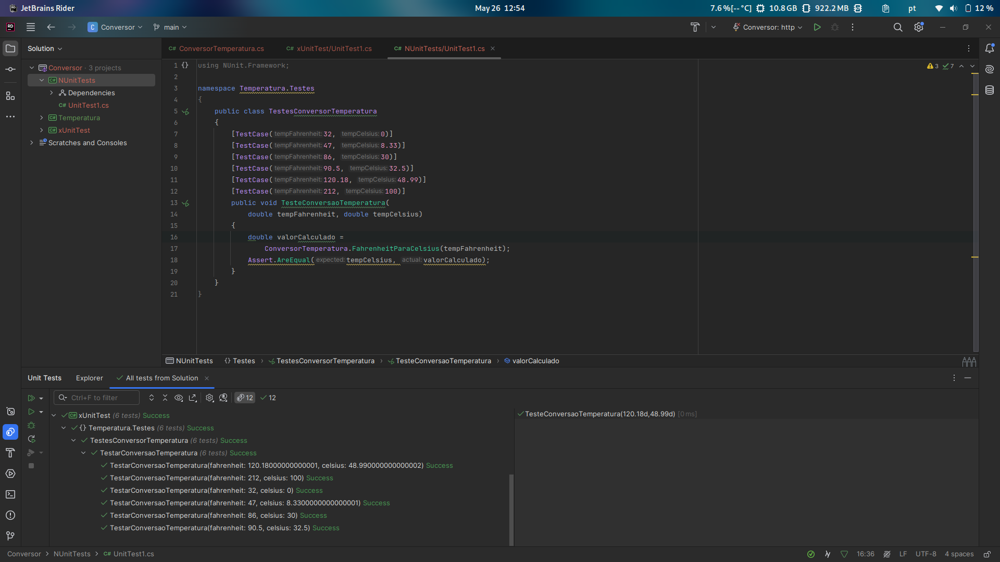
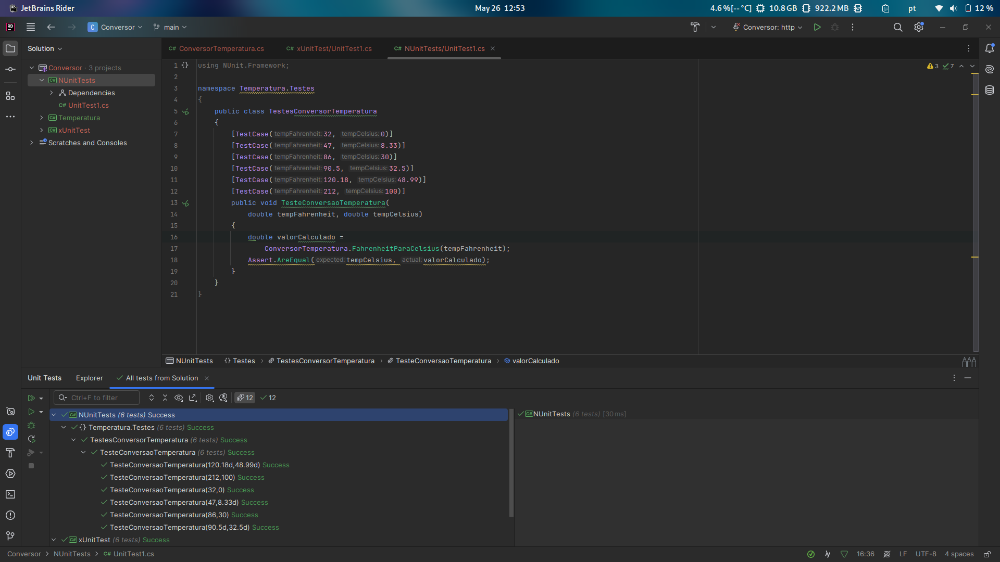
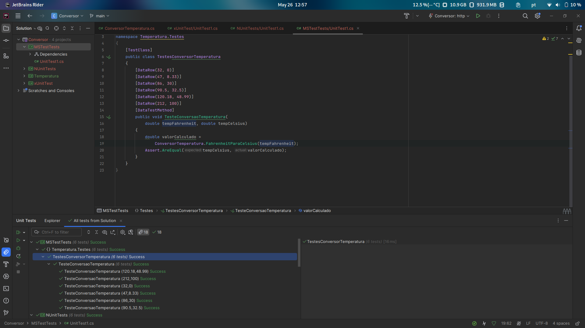
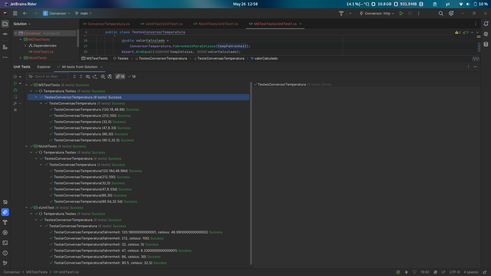

# Temperatura

## Descrição

Este projeto contém uma classe de conversão de temperatura `ConversorTemperatura` que converte valores de Fahrenheit para Celsius. Foram realizados testes para garantir o funcionamento correto da conversão, utilizando três frameworks de teste diferentes: xUnit, NUnit e MSTest.

## Estrutura do Projeto

- **Temperatura**
  - `ConversorTemperatura`: Classe responsável pela conversão de temperaturas, possuindo a função FahrenheitParaCelsius que realiza a ação de conversão de uma medida para outra.
- **Temperatura.Testes**
  - Contém os testes escritos utilizando xUnit, NUnit e MSTest.

---

## Função de Conversão de Temperatura

### Descrição

A classe `ConversorTemperatura` contém a função `FahrenheitParaCelsius` que converte uma temperatura de Fahrenheit para Celsius. O código da função é simples e direto, realizando a conversão de acordo com a fórmula matemática padrão.

### Código da Função
```csharp
using System;

namespace Temperatura
{
    public static class ConversorTemperatura
    {
        public static double FahrenheitParaCelsius(double temperatura)
            //=> (temperatura - 32) / 1.8; // Simulação de falha
            => Math.Round((temperatura - 32) / 1.8, 2);
    }
}
```

## Testes com xUnit

### Descrição

xUnit é um framework de testes moderno para .NET, conhecido por sua simplicidade e flexibilidade. Ele usa convenções intuitivas e fornece uma maneira eficaz de escrever testes unitários. Neste projeto, usamos o atributo `[Theory]` para definir um método de teste que pode ser executado com múltiplos conjuntos de dados fornecidos por `[InlineData]`.

### Aplicação dos Testes

Cada teste verifica se a função `FahrenheitParaCelsius` retorna o valor correto ao receber um valor em Fahrenheit. O método `TestarConversaoTemperatura` recebe os valores de entrada e saída esperados, e compara o resultado da função com o valor esperado utilizando `Assert.Equal`.

### Exemplos de Cenários de Teste

#### Cenário 1: Conversão de 32°F para 0°C
- **Entrada:** 32°F
- **Saída Esperada:** 0°C

#### Cenário 2: Conversão de 212°F para 100°C
- **Entrada:** 212°F
- **Saída Esperada:** 100°C

### Código de Teste

```csharp
using System;
using Xunit;

namespace Temperatura.Testes
{
    public class TestesConversorTemperatura
    {
        [Theory]
        [InlineData(32, 0)]
        [InlineData(47, 8.33)]
        [InlineData(86, 30)]
        [InlineData(90.5, 32.5)]
        [InlineData(120.18, 48.99)]
        [InlineData(212, 100)]
        public void TestarConversaoTemperatura(
            double fahrenheit, double celsius)
        {
            double valorCalculado =
                ConversorTemperatura.FahrenheitParaCelsius(fahrenheit);
            Assert.Equal(celsius, valorCalculado);
        }
    }
}
```

### Execução dos Testes

---

## Testes com NUnit

### Descrição

NUnit é um dos frameworks de teste mais antigos e amplamente utilizados para .NET. Ele é conhecido por sua robustez e flexibilidade, permitindo a definição de testes com uma sintaxe clara e expressiva. Neste projeto, usamos o atributo `[TestCase]` para fornecer múltiplos conjuntos de dados para os métodos de teste.

### Aplicação dos Testes

Cada teste verifica se a função `FahrenheitParaCelsius` retorna o valor correto ao receber um valor em Fahrenheit. O método `TesteConversaoTemperatura` recebe os valores de entrada e saída esperados, e compara o resultado da função com o valor esperado utilizando `Assert.AreEqual`.

### Exemplos de Cenários de Teste

#### Cenário 1: Conversão de 32°F para 0°C
- **Entrada:** 32°F
- **Saída Esperada:** 0°C

#### Cenário 2: Conversão de 212°F para 100°C
- **Entrada:** 212°F
- **Saída Esperada:** 100°C

### Código de Teste

```csharp
using NUnit.Framework;

namespace Temperatura.Testes
{
    public class TestesConversorTemperatura
    {
        [TestCase(32, 0)]
        [TestCase(47, 8.33)]
        [TestCase(86, 30)]
        [TestCase(90.5, 32.5)]
        [TestCase(120.18, 48.99)]
        [TestCase(212, 100)]
        public void TesteConversaoTemperatura(
            double tempFahrenheit, double tempCelsius)
        {
            double valorCalculado =
                ConversorTemperatura.FahrenheitParaCelsius(tempFahrenheit);
            Assert.AreEqual(tempCelsius, valorCalculado);
        }
    }
}
```

### Execução dos Testes



---

## Testes com MSTest

### Descrição

MSTest é o framework de teste padrão fornecido pela Microsoft para .NET. Ele é bem integrado ao Visual Studio e é amplamente utilizado em projetos que seguem as práticas de desenvolvimento da Microsoft. Neste projeto, usamos o atributo `[DataTestMethod]` em conjunto com `[DataRow]` para fornecer múltiplos conjuntos de dados aos métodos de teste.

### Aplicação dos Testes

Cada teste verifica se a função `FahrenheitParaCelsius` retorna o valor correto ao receber um valor em Fahrenheit. O método `TesteConversaoTemperatura` recebe os valores de entrada e saída esperados, e compara o resultado da função com o valor esperado utilizando `Assert.AreEqual`.

### Exemplos de Cenários de Teste

#### Cenário 1: Conversão de 32°F para 0°C
- **Entrada:** 32°F
- **Saída Esperada:** 0°C

#### Cenário 2: Conversão de 212°F para 100°C
- **Entrada:** 212°F
- **Saída Esperada:** 100°C

### Código de Teste

```csharp
using Microsoft.VisualStudio.TestTools.UnitTesting;

namespace Temperatura.Testes
{
    [TestClass]
    public class TestesConversorTemperatura
    {
        [DataRow(32, 0)]
        [DataRow(47, 8.33)]
        [DataRow(86, 30)]
        [DataRow(90.5, 32.5)]
        [DataRow(120.18, 48.99)]
        [DataRow(212, 100)]
        [DataTestMethod]
        public void TesteConversaoTemperatura(
            double tempFahrenheit, double tempCelsius)
        {
            double valorCalculado =
                ConversorTemperatura.FahrenheitParaCelsius(tempFahrenheit);
            Assert.AreEqual(tempCelsius, valorCalculado);
        }
    }
}
```

### Execução dos Testes



## Conclusão

Os testes realizados com xUnit, NUnit e MSTest validaram a classe `ConversorTemperatura` e garantiram que a conversão de temperaturas de Fahrenheit para Celsius está correta. Os frameworks de teste apresentam diferenças em suas sintaxes e funcionalidades, mas todos são eficazes para escrever testes unitários em projetos .NET.

### Resultados dos Testes em conjunto

