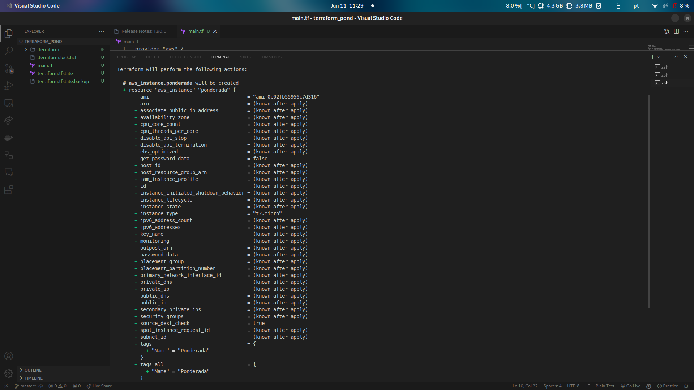
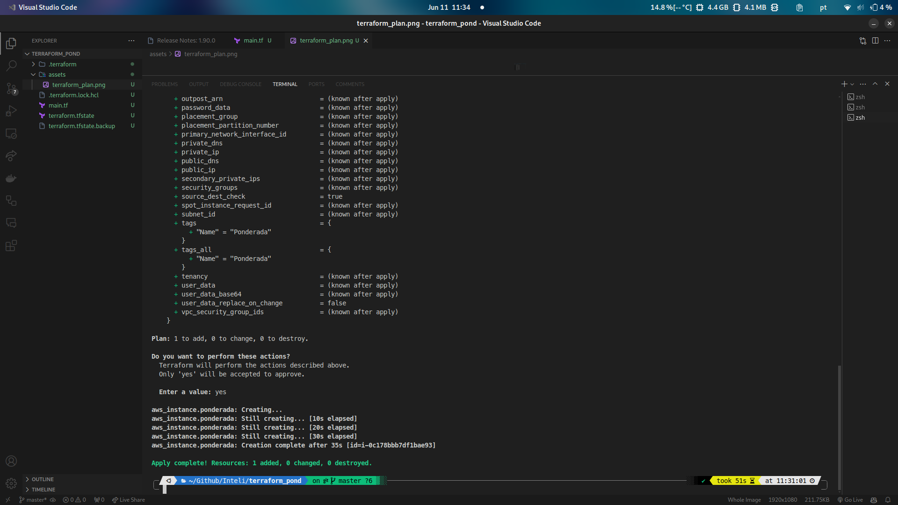
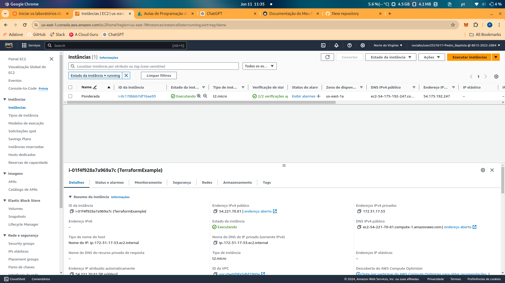

# Documentação da Atividade com Terraform

## Introdução

Esta documentação detalha o processo de criação de uma instância EC2 na AWS utilizando Terraform, abordando conceitos chave, incluindo uma comparação entre Terraform e CloudFormation, e referências para capturas de tela da execução das tarefas.

## Conceitos Importantes

### Terraform

Terraform é uma ferramenta de infraestrutura como código (IaC) que permite definir, provisionar e gerenciar a infraestrutura através de arquivos de configuração legíveis e declarativos. Com o Terraform, é possível automatizar a criação e gestão de recursos em diferentes provedores de cloud, como AWS, Azure e Google Cloud.

### Infraestrutura como Código (IaC)

IaC é uma abordagem para gerenciar e provisionar infraestrutura através de código em vez de processos manuais. Isso permite uma gestão mais eficiente e reproduzível da infraestrutura, facilitando a automação e a consistência no ambiente de TI.

### Agnosticidade de Provedor

Um dos principais benefícios do Terraform é sua natureza agnóstica em relação ao provedor de cloud. Isso significa que o Terraform pode ser usado para gerenciar infraestrutura em múltiplos provedores de cloud de forma uniforme e consistente.

#### Diferença entre Terraform e CloudFormation

- **Terraform**: É uma ferramenta agnóstica que pode ser usada para gerenciar infraestrutura em vários provedores de cloud, como AWS, Azure, Google Cloud, entre outros. Isso facilita a migração e a gestão de infraestrutura em ambientes multi-cloud.

- **CloudFormation**: É uma ferramenta específica da AWS para gerenciar infraestrutura dentro da AWS. Embora seja poderosa e integrada de forma nativa com os serviços AWS, ela não pode ser usada para gerenciar recursos em outros provedores de cloud.

## Arquivo de Configuração do Terraform (.tf)

O arquivo de configuração utilizado nesta atividade é o seguinte:

```hcl
provider "aws" {
  region = "us-east-1"
}

resource "aws_instance" "ponderada" {
  ami           = "ami-0c02fb55956c7d316"  # Amazon Linux 2 AMI (HVM), SSD Volume Type
  instance_type = "t2.micro"

  tags = {
    Name = "Ponderada"
  }
}
```

### Explicação do Código

- **Provider AWS**: Define a região onde os recursos serão provisionados. Neste caso, a região é `us-east-1`.
- **Resource aws_instance**: Configura uma instância EC2 com a imagem Amazon Linux 2 e tipo `t2.micro`, que é elegível ao nível gratuito da AWS.

## Execução das Tarefas

### 1. Planejamento da Infraestrutura

O primeiro passo é planejar a infraestrutura. Este comando verifica as configurações e mostra o que será criado.

```bash
terraform plan
```

Comando sendo executado


### 2. Aplicação do Plano

Após revisar o plano, podemos aplicar as mudanças para criar a instância.

```bash
terraform apply
```

Comando sendo executado


### 3. Instância Criada

Com o comando `apply` executado com sucesso, a instância EC2 foi criada conforme configurado.

Instância criada na AWS


## Conclusão

Através desta atividade, foi possível entender os fundamentos do Terraform e como ele pode ser utilizado para gerenciar a infraestrutura de forma eficiente e automatizada. O uso de imagens ajudou a visualizar o processo e confirmar a execução correta dos comandos.
