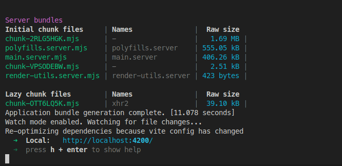
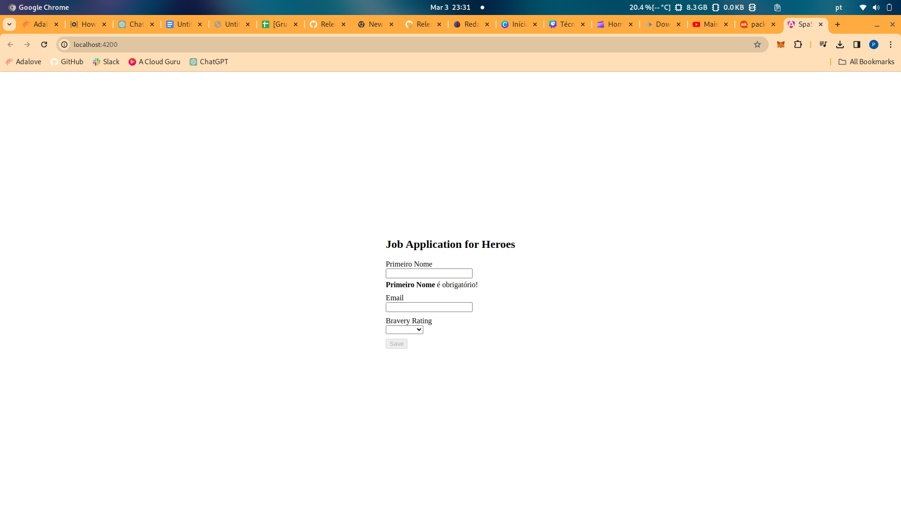
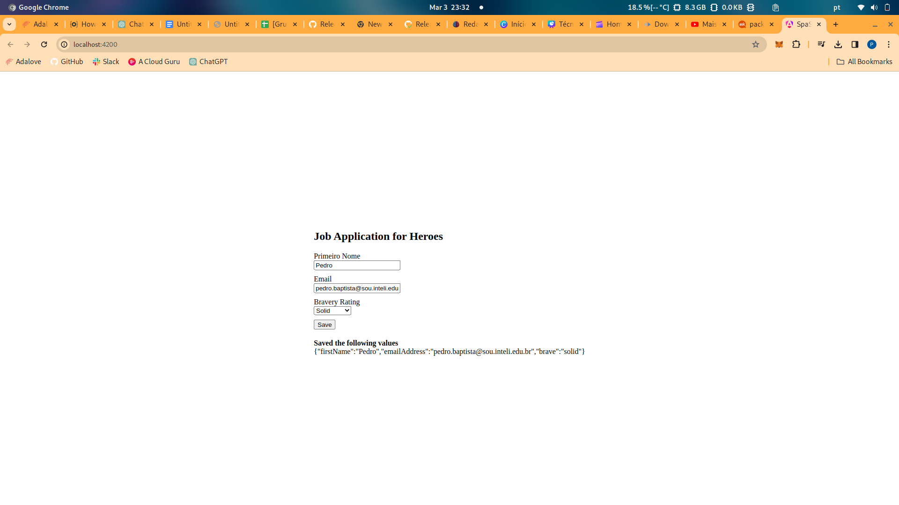

# Relatório de Autoestudo: Formulários Dinâmicos em Angular

## 1. Introdução à Tecnologia Angular e Formulários Dinâmicos

Angular é uma plataforma e framework para construção de aplicações web single-page client-side, desenvolvido em TypeScript pelo time do Google. Angular introduz várias ferramentas poderosas e técnicas, incluindo binding bidirecional de dados, injeção de dependência, modularidade, e a construção de componentes reutilizáveis, facilitando o desenvolvimento de aplicações robustas e escaláveis.

## 2. Conceitos Aprendidos

Durante o autoestudo, focamos na criação de formulários dinâmicos, uma funcionalidade crucial para aplicações interativas. Aprendemos os seguintes conceitos:

- **Componentes e Serviços:** A base do Angular, onde os componentes definem a lógica de apresentação, e os serviços gerenciam a lógica de negócios e dados.
- **Formulários Reativos:** Um paradigma de formulários que permite uma abordagem mais flexível e reativa à manipulação de dados do formulário, facilitando a validação complexa e a dinâmica de formulários.
- **Modelo de Formulário Dinâmico:** A capacidade de construir formulários que se adaptam em tempo de execução, baseado nas necessidades do usuário ou dos dados, usando um modelo de dados JSON para definir os campos do formulário, seus tipos, validações e relações.
- **Injeção de Dependência:** Um padrão de design utilizado pelo Angular para fornecer componentes com as dependências de que necessitam, sem precisar saber como essas dependências são criadas ou obtidas.

## 3. Implementação Detalhada

A implementação dos formulários dinâmicos envolveu uma abordagem modular, onde cada parte do formulário foi encapsulada em classes TypeScript específicas. A estrutura de arquivos é a seguinte:

- **`question-base.ts`:** Define a classe base para diferentes tipos de perguntas que podem ser renderizadas pelo formulário.
- **`question-control.service.ts`:** Um serviço que associa os dados do formulário com os controles do Angular, utilizando o FormBuilder para gerar os controles de formulário dinamicamente.
- **`question-dropdown.ts`:** Especifica a classe para perguntas do tipo dropdown, herdando da classe base.
- **`question-textbox.ts`:** Especifica a classe para perguntas do tipo caixa de texto, também herdando da classe base.
- **`question.service.ts`:** Este serviço é responsável por fornecer as perguntas em forma de um array, que o componente de formulário irá iterar para renderizar o formulário.

Aqui está uma visão mais detalhada de cada arquivo:

```typescript
// Exemplo de código para question-base.ts
export abstract class QuestionBase<T> {
  value: T;
  key: string;
  label: string;
  required: boolean;
  order: number;
  controlType: string;

  constructor(options: {
      value?: T,
      key?: string,
      label?: string,
      required?: boolean,
      order?: number,
      controlType?: string
    } = {}) {
    this.value = options.value;
    this.key = options.key || '';
    this.label = options.label || '';
    this.required = !!options.required;
    this.order = options.order === undefined ? 1 : options.order;
    this.controlType = options.controlType || '';
  }
}
```
```typescript
// Exemplo de código para question-dropdown.ts
import { QuestionBase } from './question-base';

export class DropdownQuestion extends QuestionBase<string> {
  controlType = 'dropdown';
  options: {key: string, value: string}[] = [];

  constructor(options: {} = {}) {
    super(options);
    this.options = options['options'] || [];
  }
}
```

O componente dynamic-form age como um consumidor dessas definições de pergunta, utilizando o QuestionControlService para transformar as perguntas fornecidas pelo QuestionService em um FormGroup completo. Isso é então utilizado pelo app.component.ts para renderizar o formulário e gerenciar as submissões.

```typescript
// dynamic-form.component.ts
@Component({
  selector: 'app-dynamic-form',
  templateUrl: './dynamic-form.component.html',
  styleUrls: ['./dynamic-form.component.css']
})
export class DynamicFormComponent implements OnInit {
  @Input() questions: QuestionBase<any>[] = [];
  form: FormGroup;
  payLoad = '';

  constructor(private qcs: QuestionControlService) {  }

  ngOnInit() {
    this.form = this.qcs.toFormGroup(this.questions);
  }

  onSubmit() {
    this.payLoad = JSON.stringify(this.form.getRawValue());
  }
}
```

No app.component.ts, o formulário dinâmico é utilizado da seguinte forma:

```typescript
// app.component.ts
@Component({
  selector: 'app-root',
  template: `
    <div>
      <h2>Job Application for Heroes</h2>
      <app-dynamic-form [questions]="questions"></app-dynamic-form>
    </div>
  `,
})
export class AppComponent {
  questions: any[];

  constructor(service: QuestionService) {
    this.questions = service.getQuestions();
  }
}
```

### Componente `dynamic-form`

O componente `dynamic-form` atua como um consumidor das definições de perguntas, utilizando o `QuestionControlService` para transformar as perguntas fornecidas pelo `QuestionService` em um `FormGroup` completo. Este `FormGroup` é utilizado pelo `app.component.ts` para renderizar o formulário e gerenciar as submissões.

### Integração no `app.component.ts`

No `app.component.ts`, o componente raiz da aplicação Angular, o `dynamic-form` é declarado e inserido. Este arquivo inicializa o formulário dinâmico e o integra com o restante da aplicação.

A integração desses componentes e serviços permite que o formulário seja construído dinamicamente no tempo de execução, com base nos metadados definidos nos arquivos TypeScript da pasta question.

## 4. Screenshots do Código em Execução

[Terminal buildando o frontend](./images/terminal.png)

[Página Inicial Aplicação](./images/aplicacao.png)

[Teste de funcionamento do formulário](./images/funcionamento.png)





## 5. Conclusão
Através deste estudo, ganhamos uma compreensão profunda do poder e flexibilidade que Angular oferece para o desenvolvimento de aplicações web, especialmente no que diz respeito à criação de formulários dinâmicos. A habilidade de construir formulários que se adaptam às necessidades dos usuários em tempo real não só melhora a experiência do usuário, mas também nos permite lidar com requisitos complexos de forma elegante e eficiente.