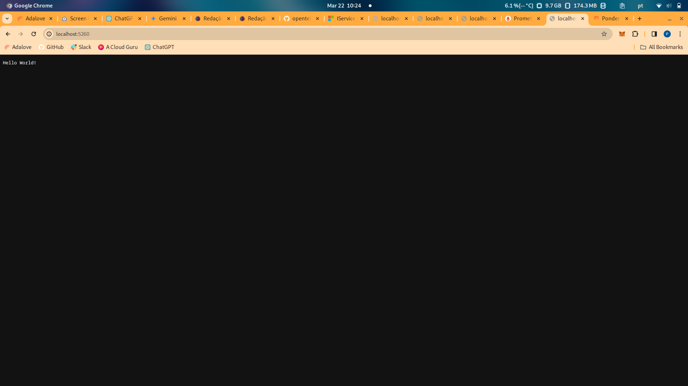
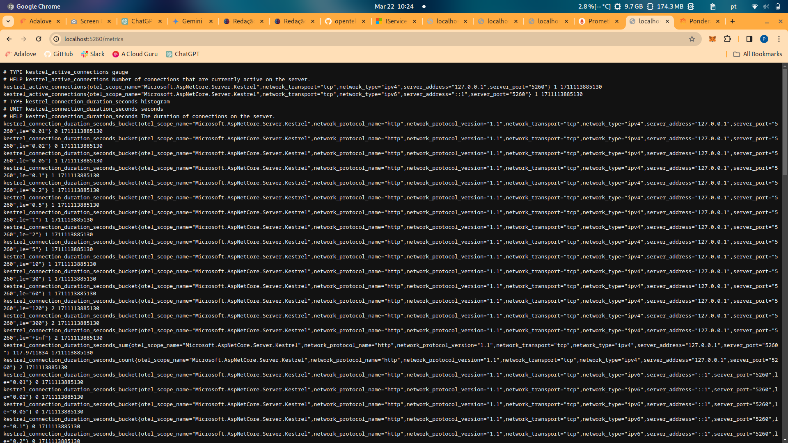
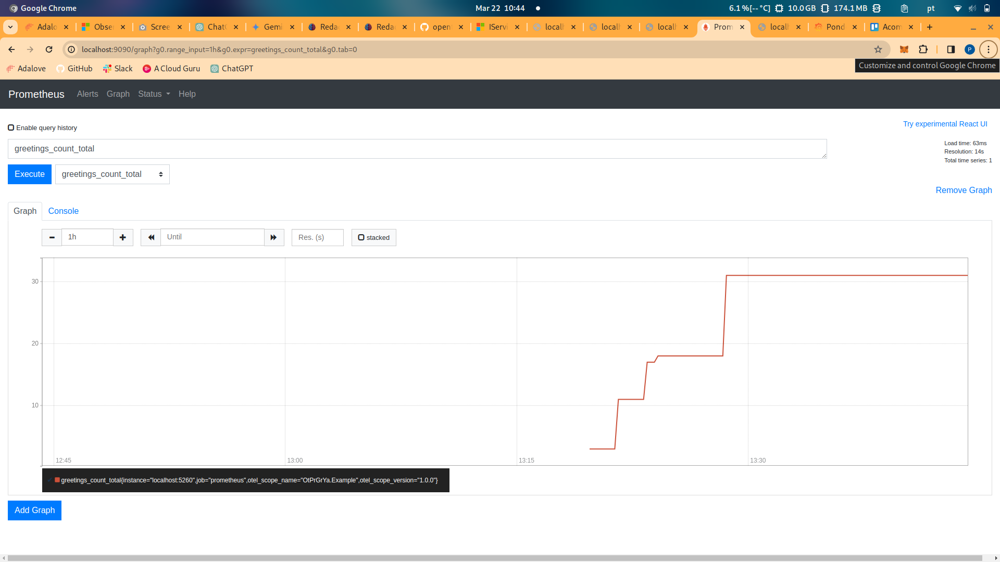
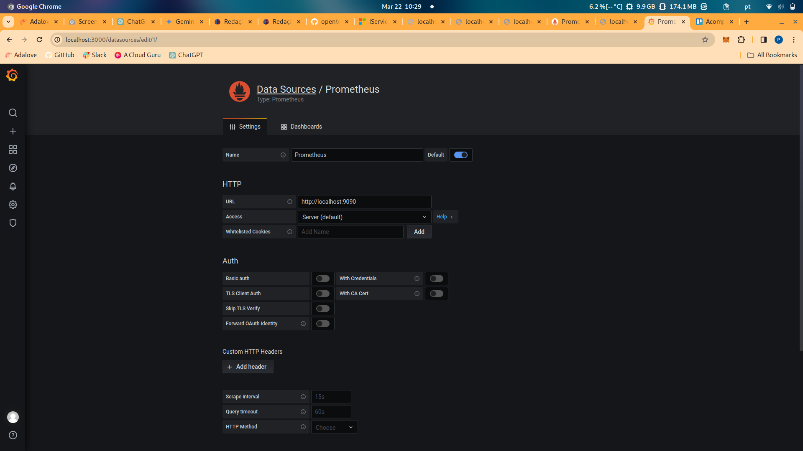
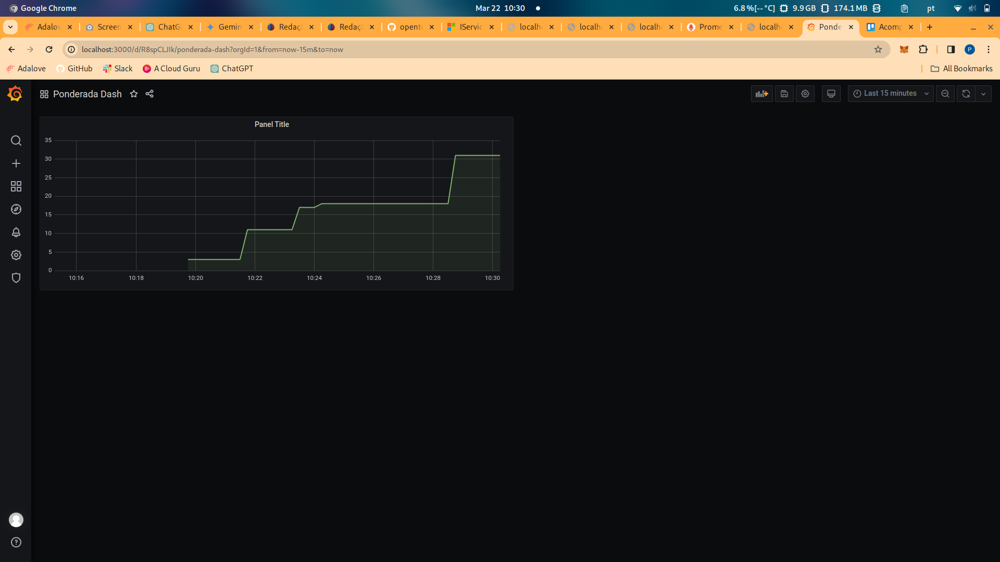
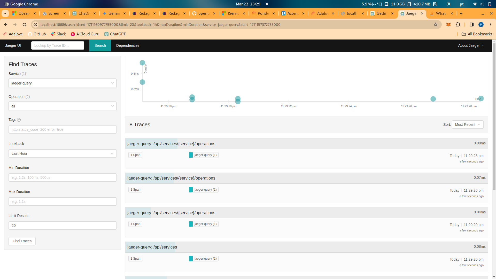

# Relatório atividade Observabilidade - Pedro Hagge Baptista

## Introdução
Durante a realização dessa atividade eu desenvolvi e monitorei uma API em C# utilizando uma série de tecnologias avançadas de observabilidade e monitoramento. Este relatório detalha as tecnologias utilizadas, os conceitos aprendidos e como eles foram aplicados no projeto.

## Tecnologias utilizadas

### OpenTelemetry
OpenTelemetry é um conjunto de APIs, bibliotecas e ferramentas que são usadas para coletar, processar e exportar métricas, logs e traços de telemetria de uma aplicação. É um projeto da Cloud Native Computing Foundation (CNCF) que visa fornecer observabilidade uniforme para microserviços e aplicações distribuídas.

### Prometheus
Prometheus é um sistema de monitoramento e alerta de código aberto. Ele coleta e armazena suas métricas como séries temporais, permitindo que você consulte, visualize e alerte sobre os dados. É amplamente usado devido à sua simplicidade e eficácia, especialmente em ambientes de nuvem e microserviços.

### Grafana
Grafana é uma plataforma de análise e visualização de dados de código aberto. É comumente usado para visualizar séries temporais de dados de monitoramento de infraestrutura e aplicações. Grafana permite que você crie dashboards dinâmicos que podem ser personalizados para exibir uma ampla gama de métricas.

### gRPC e Jeager para telemetria com OTLP
gRPC é um framework de chamada de procedimento remoto de alta performance que pode ser usado para conectar serviços em diferentes ambientes. Jaeger, um sistema de rastreamento distribuído, suporta o recebimento de dados de telemetria via OTLP (OpenTelemetry Protocol) sobre gRPC, proporcionando uma maneira eficiente de coletar, visualizar e analisar traços de aplicações distribuídas.

## Conceitos aprendidos

### OpenTelemetry
Comecei integrando o OpenTelemetry ao meu projeto para coletar, processar e exportar métricas, logs e dados de rastreamento. Aprendi que o OpenTelemetry é essencial para fornecer observabilidade em aplicações modernas, especialmente em ambientes distribuídos. Configurei recursos do OpenTelemetry com o nome da aplicação e instrumentei a aplicação para coletar métricas e traços, utilizando tanto instrumentações automáticas quanto personalizadas para ASP.NET Core e HttpClient. Essa experiência me ensinou a importância da coleta de dados granulares para diagnóstico e monitoramento eficaz.

### Prometheus
Integrei o Prometheus ao projeto para armazenar e consultar as métricas coletadas. O Prometheus, sendo um sistema de monitoramento e alerta de código aberto, mostrou-se uma ferramenta poderosa para lidar com séries temporais de dados. Aprendi a configurar o exportador do Prometheus no OpenTelemetry para expor as métricas em um formato adequado, permitindo que o Prometheus as coletasse periodicamente. Isso reforçou meu entendimento sobre como as métricas podem ser usadas para monitorar a saúde e o desempenho de uma aplicação em tempo real.

### Grafana
Para visualizar as métricas coletadas, utilizei o Grafana. Através desta plataforma de análise e visualização de dados, criei dashboards dinâmicos que exibem as métricas de maneira intuitiva. A experiência com o Grafana ampliou minha compreensão sobre como transformar dados brutos em insights acionáveis, facilitando a identificação de tendências, padrões e potenciais problemas dentro da aplicação.

### gRPC e Jeager com OTLP
Configurar o Jeager para receber métricas e traços via OTLP sobre gRPC foi uma parte crucial do projeto. O uso do gRPC, um framework de chamada de procedimento remoto, juntamente com o Jeager, um sistema de rastreamento distribuído, permitiu uma coleta eficiente e detalhada de dados de telemetria. Essa integração me deu uma perspectiva valiosa sobre como o monitoramento detalhado pode melhorar a performance e a confiabilidade de aplicações distribuídas.

## Printscreen de execução

### API em execução

### API retornando métricas

### Prometheus rodando com localhost

### Prometheus retornando métricas

### Gráfico de métricas no Prometheus

### Grafana configurado com Prometheus

### Grafana exibindo métricas

### Jaeger rodando com localhost

## Conclusão
Esta atividade me proporcionou uma experiência hands-on com o desenvolvimento e monitoramento de uma API em C#, e também aprofundou meu entendimento e habilidades em tecnologias essenciais de observabilidade, como OpenTelemetry, Prometheus, Grafana, e Jeager. A integração dessas ferramentas e práticas ofereceu uma visão sobre como monitorar e melhorar a performance e a confiabilidade de aplicações modernas, preparando-me para enfrentar desafios complexos de desenvolvimento e operações no futuro.

## OBS
O prometheus, o grafana e o jaeger estão rodando em containers docker, para rodar o projeto é necessário ter o docker instalado, além disso, como eles devem se comunicar para que as métricas sejam passadas de um para o outro, é necessário rodar os containers com o network mode host, para isso, basta rodar o comando do docker run com a flag --network host, como no exemplo abaixo. Ademais, o motivo pelo qual não subi o docker-compose é porque tendo em vista que estou rodando com linuz, estava encontrando diversos problemas para enviar o prometheus.yml como um volume pelo docker-compose, sendo assim, eu rodei todos os containers de forma manual com o comando docker run, mas caso queira visualizar o docker-compose que eu montei (está com problemas em linux), eu posso lhe enviar depois.